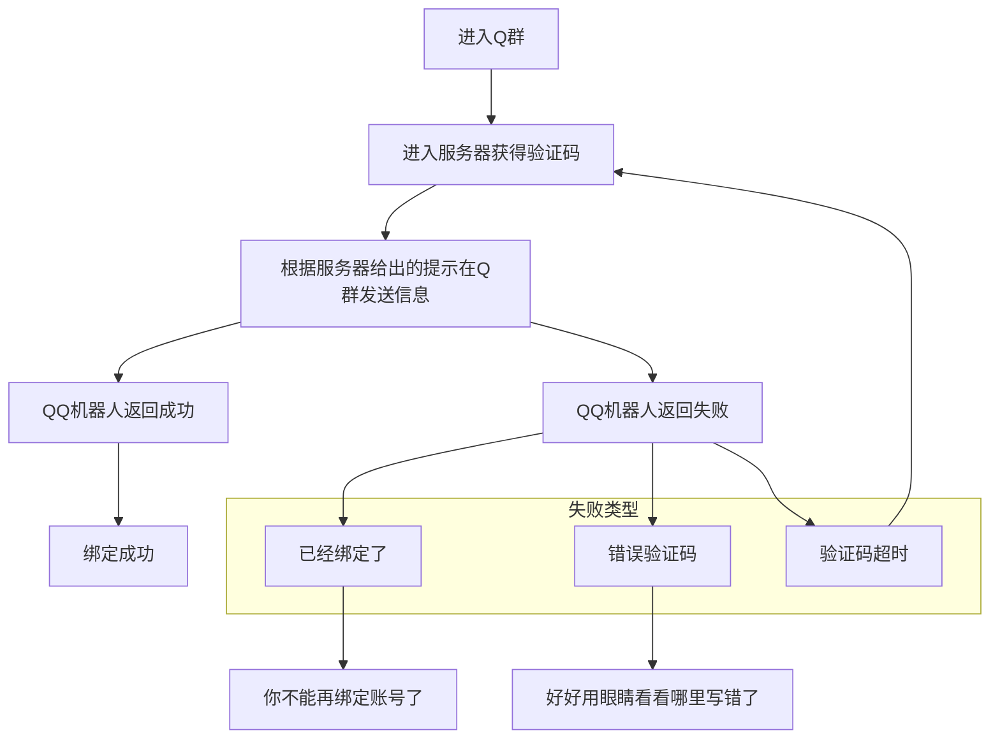

::: details 概括

```mermaid
graph TD;
    进入Q群-->进入服务器获得验证码;
    进入服务器获得验证码-->根据服务器给出的提示在Q群发送信息;
    根据服务器给出的提示在Q群发送信息-->QQ机器人返回成功;
    根据服务器给出的提示在Q群发送信息-->QQ机器人返回失败;
    QQ机器人返回成功-->绑定成功;
    subgraph 失败类型
    已经绑定了
    错误验证码
    验证码超时
    end
    QQ机器人返回失败-->已经绑定了-->你不能再绑定账号了;
    QQ机器人返回失败-->错误验证码-->好好用眼睛看看哪里写错了;
    QQ机器人返回失败-->验证码超时-->进入服务器获得验证码;
```
:::

## 加入Q群

本服务器使用了 `一Q一号` 的绑定制度，你要进服首先就进入[QQ群](https://jq.qq.com/?_wv=1027&k=HSSe2Rxe)。

## 进入服务器

请使用 Minecraft Java版

- [ray](foo/ray.md)
- ...