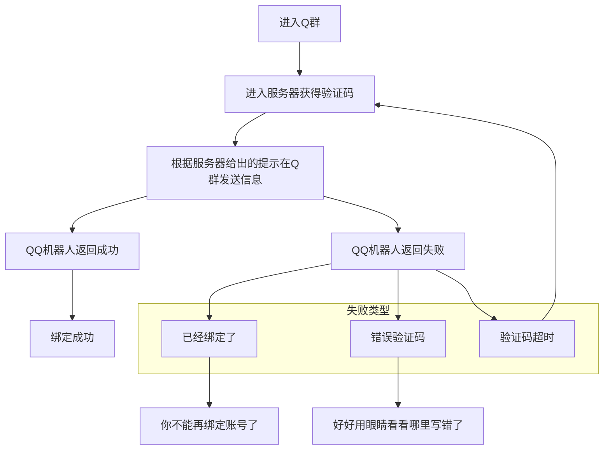

::: details 流程

:::

## 加入Q群

**由于本群机器人出现了一些问题，正在开发新的机器人，所以目前暂时不需要绑定您的QQ和游戏账号**

本服务器使用了 `一Q一号` 的绑定制度，你要进服首先就进入[QQ群](https://jq.qq.com/?_wv=1027&k=HSSe2Rxe)。

## 进入服务器

::: tip 推荐使用

启动器: [PCL2](https://afdian.net/p/0164034c016c11ebafcb52540025c377)

整合包: Fabulously Optimized (在PCL2里可以下到，优化挺好的)

:::

请使用 Minecraft Java版 `1.16.5~1.19.2` 版本进服，我们推荐使用 `1.19.1及以上` 版本进服，将会有更完整的游戏体验。

服务器地址:

::: code-tabs

@tab 主线

```IP
ddns.hentai.net.cn:19747
```

@tab 备用

```IP
mc.myf.world:19747
```

:::

然后根据屏幕上的提示，在Q群中发送指定文本，你就可以进服游玩啦
